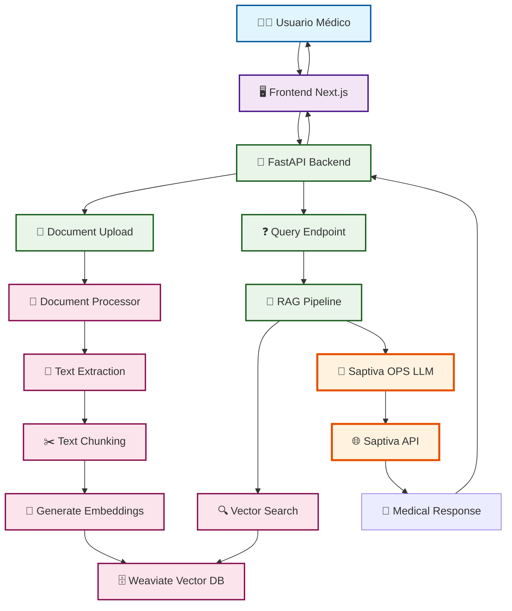
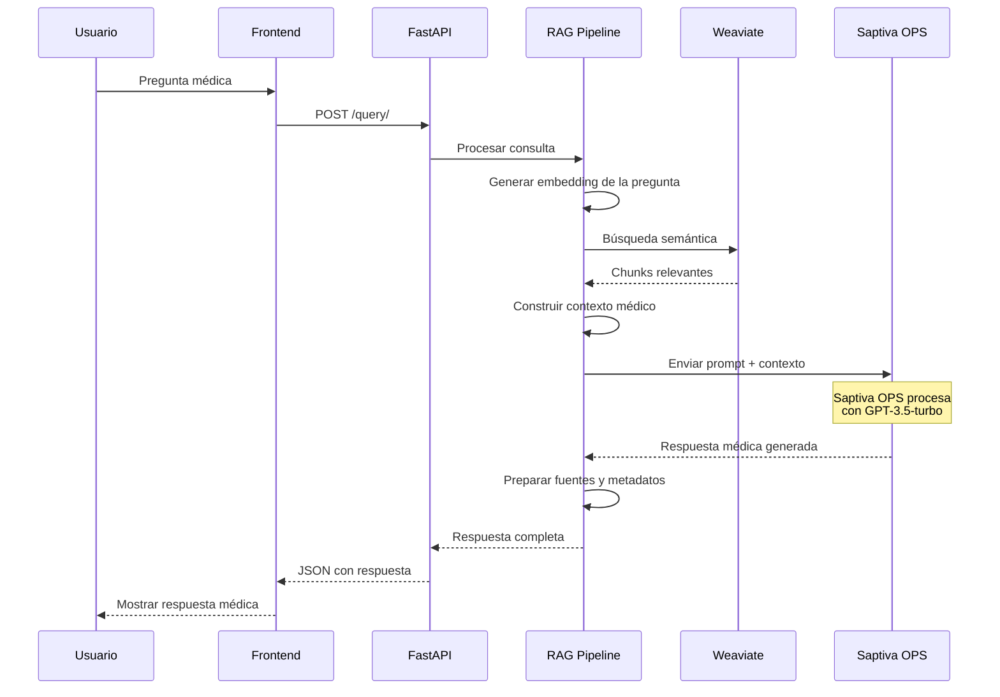
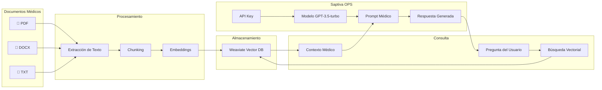

# Diagrama: Uso de Herramientas Saptiva en MediCopilot

## Arquitectura del Sistema con Saptiva OPS



## Flujo Detallado de Saptiva OPS



## Componentes de Saptiva en el Código

### 1. Cliente LLM (llm.py)
```python
class SaptivaLLMClient:
    - API Key: settings.SAPTIVA_API_KEY
    - Endpoint: settings.SAPTIVA_API_URL
    - Modelo: gpt-3.5-turbo
    - Funciones:
      * generate_response()
      * test_connection()
      * _build_prompt()
```

### 2. Integración en RAG (rag.py)
```python
class RAGPipeline:
    - Usa SaptivaLLMClient para generar respuestas
    - Construye contexto médico con chunks relevantes
    - Procesa respuestas y fuentes
```

### 3. Configuración (config.py)
```python
SAPTIVA_API_KEY = "tu_clave_api_aqui"
SAPTIVA_API_URL = "https://api.saptiva.com/v1/chat"
```

## Flujo de Datos con Saptiva



## Características de Saptiva en MediCopilot

### ✅ Implementado
- **Integración API**: Cliente HTTP para Saptiva OPS
- **Modelo GPT-3.5-turbo**: Configurado para respuestas médicas
- **Prompt Engineering**: Contexto médico especializado
- **Manejo de Errores**: Timeout y retry logic
- **Autenticación**: Bearer token con API key

### 🔧 Configuración
- **API Key**: Variable de entorno `SAPTIVA_API_KEY`
- **Endpoint**: `https://api.saptiva.com/v1/chat`
- **Timeout**: 30 segundos
- **Max Tokens**: 1000
- **Temperature**: 0.7

### 📊 Flujo de Respuesta
1. **Pregunta** → Embedding → Búsqueda en Weaviate
2. **Contexto** → Construcción con chunks relevantes
3. **Prompt** → Envío a Saptiva OPS con contexto médico
4. **Respuesta** → Procesamiento y envío al usuario
5. **Fuentes** → Metadatos de chunks utilizados

## Ventajas de Saptiva OPS

- 🎯 **Especialización Médica**: Modelo entrenado para contexto médico
- 🔒 **Seguridad**: API key para autenticación
- ⚡ **Rendimiento**: Respuestas rápidas y confiables
- 🌐 **Escalabilidad**: Servicio en la nube
- 🔧 **Configurabilidad**: Parámetros ajustables (temperature, max_tokens)

## Próximas Mejoras

- [ ] **Modelos Especializados**: Integrar modelos médicos específicos
- [ ] **Streaming**: Respuestas en tiempo real
- [ ] **Caching**: Cache de respuestas frecuentes
- [ ] **Monitoreo**: Métricas de uso de Saptiva
- [ ] **Fallback**: Modelos alternativos en caso de fallo
